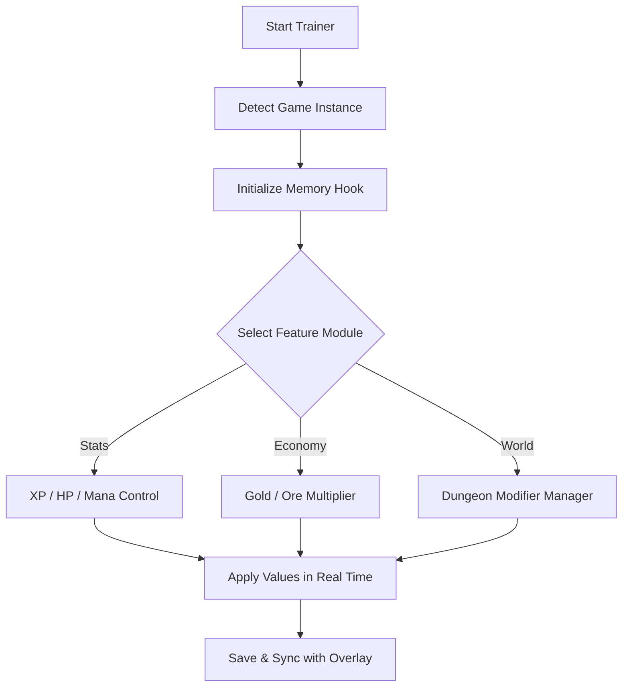

# Heroes of Hammerwatch II Trainer ⚔️

Dive deeper into the endless dungeon with **Heroes of Hammerwatch II Trainer**, a meticulously engineered utility for those who crave precision, freedom, and balance control in every heroic run. Shape your campaign exactly how you wish — no grind, no limits, just pure adventure mastery.

---

## 🏰 Overview

The **Trainer** extends the boundaries of the game’s roguelike loop. You can fine-tune hero attributes, multiply loot drops, alter world events, and automate repetitive upgrades. Designed with stability in mind, it integrates directly with game memory to provide seamless, real-time adjustments — no file editing, no crashes, just power at your fingertips.


---

## ⚙️ Core Features

* **Gold & Ore Multipliers:** Instantly amplify loot drops and currency values.
* **XP & Level Boost:** Jump straight into late-game builds without grinding.
* **Invulnerability Mode:** Survive traps, poison, or spikes — perfect for testing boss patterns.
* **Skill Cooldown Control:** Adjust ability recharge to any time value.
* **Item Spawner:** Summon rare artifacts or potions directly from your hotbar.
* **Dungeon Modifiers:** Control difficulty scaling, trap density, or enemy spawn rate.
* **Auto-Save Shield:** Ensures game integrity during heavy modifications.

[!NOTE]

> Heroes of Hammerwatch II Trainer modifies only *local memory states*. It does not affect online leaderboards or multiplayer instances.

---

## 🧩 Compatibility

| Platform           | Status     | Notes                      |
| ------------------ | ---------- | -------------------------- |
| Windows 10         | ✅ Full     | Tested under DX11          |
| Windows 11         | ✅ Full     | Smooth overlay performance |
| Steam              | ✅          | Auto-path detection        |
| GOG                | ⚠️ Partial | Manual setup required      |
| Controller Support | ✅          | Customizable radial menus  |

---

## ⚡ Setup & Launch

1. **Extract** the trainer files into your game directory.
2. Launch the trainer first:

   ```bash
   HeroesHammerwatch2_Trainer.exe --init
   ```
3. Run the game as usual.
4. Press **F6** to activate overlay.
5. Configure cheats via on-screen toggles or console commands.

[!IMPORTANT]

> Always launch the trainer **before** loading a save file to ensure proper sync with character stats.

---

## 🧭 Function Flow



---

## 🧙 Example Configs

You can predefine entire loadouts in `.ini` format for quick loading:

```ini
[paladin_build]
hp=9999
mana=500
xp_multiplier=3.5
cooldown=0.25

[rogue_build]
speed=2.0
crit_chance=1.8
stealth=true
gold_bonus=4.0
```

Save different playstyles (tank, speedrunner, collector) and switch mid-dungeon using **F7**.

[!WARNING]

> Setting multipliers beyond `5x` may overflow experience counters. Adjust moderately for stability.

---

## ❓ FAQ

**Q: Is the Trainer compatible with the latest updates?**
A: Yes. It automatically syncs with patch offsets and adjusts variable tables dynamically.

**Q: Can I use it in multiplayer?**
A: No. The Trainer is designed for offline or private play sessions only.

**Q: Will it damage my save file?**
A: No. It hooks only temporary runtime memory — your data remains intact.

**Q: Can I remap hotkeys?**
A: Yes, modify `/config/hotkeys.json` or use the overlay settings panel.

**Q: What’s the safest setup?**
A: Use default values, keep autosave on, and avoid modifying enemy AI simultaneously with difficulty multipliers.

---

## ⚒️ Advanced Features

* **“Sandbox Mode”:** Enables free camera, teleport, and time-skip options.
* **“Rush Mode”:** Auto-clears enemies below 30% HP for speed runs.
* **“Forge Boost”:** Craft high-tier gear instantly using stored materials.

[!NOTE]

> Developers recommend pairing “XP Boost” + “Rush Mode” for testing dungeon layouts or class rebalancing.

---

## 🌟 Performance Tips

* Run the game in **borderless windowed** for best overlay responsiveness.
* Use **low refresh overlays** (60Hz) for older GPUs.
* Export config presets with:

  ```bash
  trainer --export "speedrun_set.cfg"
  ```

[!WARNING]

> Avoid minimizing the game during real-time variable writes — it may pause memory access threads.

---

## 🏹 Final Thoughts

The **Heroes of Hammerwatch II Trainer** transforms challenge into art. Build legendary heroes instantly, skip repetitive grinding, and master every dungeon floor with confidence. It’s not about breaking balance — it’s about refining it.

---

*Enter the depths as a legend, not a wanderer — Heroes of Hammerwatch II Trainer gives you the power to forge destiny itself.*
